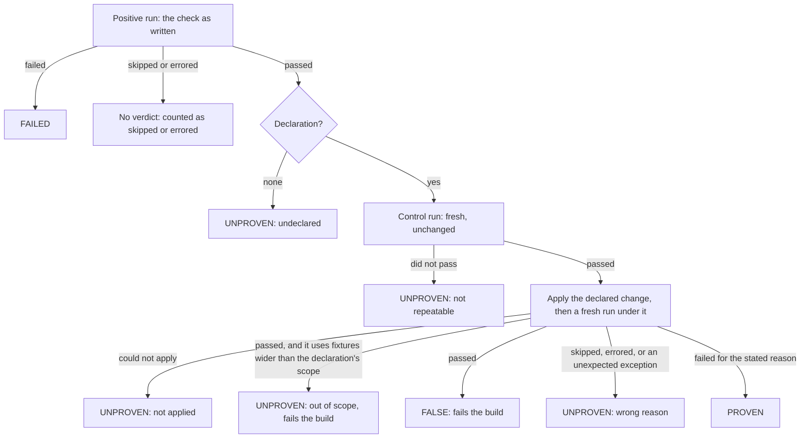

# Falsetto

**A green you can trust.**

Falsetto helps agentic AI coding agents identify bad tests and evals while they write and run them. Today, agents write tests and evals at a volume that makes human validation infeasible. Test runners only report pass and fail. They cannot identify a test that cannot fail. Mutation tools evaluate a whole suite with random edits, take hours, and report which edits survived, not which test is at fault. Bad tests create a false sense of confidence for agents and humans.

Falsetto is a pytest plugin that finds the false voice in your suite and shouts loudly at it. Falsetto asks each test for one change to the code being tested that should make it red, runs the test without and then with that change, and only counts tests that fail when they should. The result is a green you can trust: every passing check deliberately proven able to fail, checks that quietly stop being able to fail turn the build red, and agents get real-time signal while they build and run.

## The problem, in one example

A message router copies a thread key from the incoming message onto the outgoing route.

```python
import falsetto
import router

_original_pick_route = router.pick_route


def pick_route_dropping_thread_key(msg):
    route = _original_pick_route(msg)
    return router.Route(thread_key=None, queue=route.queue)


@falsetto.must_fail_when(lambda m: m.setattr(router, "pick_route", pick_route_dropping_thread_key))
def test_route_keeps_thread_key(msg):
    route = router.pick_route(msg)
    assert route.thread_key == msg.thread_key
```

The declaration answers one question: what change should make this red? Here it is "the router drops the thread key", written as a small hand-made broken version of the function. Falsetto runs the test under that change, the assertion trips, and the test is **proven**.

A month later a colleague simplifies the shared fixture in another file, so `msg.thread_key` now defaults to `None`. Every test still passes. This one now asserts `None == None`. Under the declared change it still passes, because a dropped key is also `None`. Falsetto reports it **false** on that pull request, and the build fails. Nobody touched the test. Every other runner said green.

## How it works

**Green means nothing until it can go red.**

1. **The declaration.** Every check declares one change to the **subject** (the code under test, its input, its fixture, or its environment) that must make the check fail. The change is ordinary code you write, applied through a patching handle that reverts everything afterwards. Nothing is generated, nothing of yours is edited on disk, and no model is involved.
2. **Three runs.** The check runs as written and must pass. It runs a second time, unchanged, as a whole fresh test with setup and teardown, and must pass again: that control run catches every check that does not pass on its second execution, before a failure could be credited to the change. Then it runs under the declared change, applied before setup, and must fail with an assertion.
3. **Four verdicts.**

| Verdict | Meaning |
|---|---|
| **proven** | Passed as written, passed again without the change, and failed under it. |
| **failed** | Failed as written. An ordinary red check. |
| **false** | Passed as written, and still passed under its declared change. The check is wrong. **This fails the build.** |
| **unproven** | Nothing is known yet: no declaration, or no failure could be attributed to the change. Fails the build in strict mode. Four kinds always fail the build: **out of scope** (the check uses a fixture wider than its declaration rebuilds, so the change may never have reached it), **misconfigured** (a declaration or marker that contradicts itself), **not reverted** (the declared change could not be undone, so every later check would run against a patched subject; the session stops there), and **internal error** (Falsetto itself failed while grading). |



The verdict line carries its denominator, so a suite where nothing was graded can never read as a suite where everything was:

```
falsetto: 12 proven, 1 failed as written, 2 false, 3 unproven (18 graded of 21 run; 2 skipped, 1 excluded)
```

A false check is a real pytest failure: stop-on-first-failure stops on it, `--lf` reruns it, JUnit output counts it, and the exit status reflects it. A crash inside Falsetto is reported as Falsetto's crash, loudly, never as the check failing.

## Why now

Agents now write and run tests at scale. A false-green test is the failure that scales silently: it hides a defect behind a passing suite, and nothing in today's runners can see it. Falsetto bites twice.

- **At authoring.** The agent, or the person, must answer "what change should make this red" before the test exists. Tests written to answer that question are better on the first run. Strict mode makes the answer mandatory.
- **On vacuity.** A change elsewhere makes a proven test unable to fail, and it slides from proven to false without anyone touching it. Falsetto catches it on the change that did it.

## For coding agents and their harnesses

Falsetto is built to sit inside the loop an agent already runs, with no human in the middle.

- **A gate the agent cannot talk its way past.** In strict mode a test without a declaration, or a declaration that does not bite, is a red build. The agent cannot report green until every check it wrote has been made to fail once. Put `falsetto_strict = true` in the project's pytest configuration and the rule applies to every session, whichever agent is running.
- **Hints written for the author who has to act.** Every non-green verdict carries a stable reason code, one sentence, and a hint that says what to change: declare the change, narrow it, widen its scope, build the state in fixtures. The agent that wrote the test is the expected reader.
- **A machine channel.** `--falsetto-json` writes every verdict with its reason, detail, evidence and whether it fails the build, under a schema number and the run's context (root directory, arguments, strict mode, versions, times), and the same record rides pytest's `user_properties` into JUnit. A harness reads verdicts without parsing a terminal. Two things no report can settle: a **false** verdict is consistent with a tautological test and with a product bug the test happens not to see, and an **unproven** verdict cannot know which change the author meant to guard against. Both need the code read.

## Evals too

An evaluation cell is a check. Its declared change is a planted wrong answer or a null baseline: swap the model for random output, or hand the judge a known-bad response, and the score must collapse. A judge that scores garbage high is a **false** eval. An eval minted at runtime without its falsifier is **unproven**, never a pass. Falsetto is meant for unit tests, integration tests, and evals, whether the evals are static or constructed on the fly.

## Using it

```
pip install falsetto        # or pip install -e . from a clone
pytest --falsetto           # grade every function-based check
pytest --falsetto-strict    # and count unproven checks as failures
pytest --falsetto --falsetto-json=verdicts.json
```

Or in `pyproject.toml`, so the flag is never forgotten:

```toml
[tool.pytest.ini_options]
falsetto = true
falsetto_strict = true
```

Falsetto is inert unless enabled. A check that cannot be proven on purpose, such as one that talks to a live service, is excluded with `@pytest.mark.no_proof("reason")`; the reason is required, the check is listed by name in the summary, and it is counted as excluded in the verdict line, never as a proof (pytest's own counters still show it as passed). In strict mode a session that ran checks and graded none fails, whatever the reason, except in modes that run nothing, such as `--collect-only` or `--setup-only`.

**The declaration.** `@falsetto.must_fail_when(change, *, expect=None, describe=None, scope="function")`. `change` receives a handle with `setattr`, `setitem`, `delattr`, `delitem`, `setenv` and `delenv`; everything it does is undone after the run, and a class attribute comes back as the descriptor it was. By default the check must fail with an `AssertionError` or a `pytest.fail`; any other exception is "wrong reason", never proof. Pass `expect=SomeError` when the failure you mean is a different one. Pass `describe="..."` to name the change in reports; without it a named function is reported by its qualified name and a lambda by its source text, so anything sensitive in a lambda, such as a credential passed to `setenv`, needs a `describe`. `scope` says how deep the change reaches: which fixture scopes ("function", "class", "module", "package" or "session") are rebuilt under it for every run. The default rebuilds only function-scoped fixtures. A check that uses a fixture wider than that, by any route, and still passes under the change is reported out of scope with the fixture named, and that fails the build: the check cannot be graded under its declaration until the scope is widened or the check reads the subject directly. Fixtures pytest or an installed plugin defines never count. `scope="session"` rebuilds the session's fixtures for that check and for every test after it, so a suite whose later tests rely on state accumulated in session fixtures sees it reset.

**Beyond pytest.** `falsetto.check_callable(fn, declaration)` grades a plain callable with the same four verdicts, for a bespoke harness. Its default expectation is `AssertionError` alone; pass `default_expect=` to widen it. The pytest plugin is one adapter over that core; nothing else computes a verdict.

## What Falsetto needs from your tests

- **Repeatability.** A declared check runs three times. A check whose second run fails on its own, because it counts calls at module level or consumes something shared, is reported unproven with a hint, never proven. Residue that first appears on the third run is credited to the change and reported proven; `--falsetto-controls 2`, or the `falsetto_controls` ini key, adds a control run and catches it at the cost of a fourth run.
- **Changes through the handle.** A declaration that mutates state without the handle is not reverted, and its damage lands on a later test.
- **Names looked up at call time.** Patching `module.function` does not reach a name the test copied in with `from module import function`. The hint on a false verdict says so.

Costs to know about: a declared check takes about three times as long, `--durations` reports the first run only, `tmp_path` yields a fresh directory per run, and the control and negative runs are kept out of coverage measurement so a stub cannot inflate it. A timeout plugin that arms one budget per test protocol spends it across all runs; pytest-timeout's `timeout_func_only` setting gives each run its own. `--pdb` and `--trace` stay closed during the control and negative runs, but other consumers of pytest's exception-interaction hook still see the deliberate failure. Falsetto grades function-based checks, including `unittest.TestCase` methods. Doctests and custom item types are left to pytest and counted as not gradable. Plugins that also take over the run protocol, such as rerun plugins, compete with Falsetto for each check, and whichever pytest calls first wins; Falsetto names them in a warning at startup and reports the checks they ran as not graded, never as passes.

## Status

Pre-alpha, released on PyPI as 0.0.1 on 2026-09-18. The design is in [docs/design.md](docs/design.md), the execution path in [docs/how-it-works.md](docs/how-it-works.md), the build plan in [docs/plan.md](docs/plan.md), and what came before in [docs/prior-art.md](docs/prior-art.md). The router example under `examples/router` prints one check per verdict:

```
pytest examples/router --falsetto
```

Inside this repository the strict setting also applies, so the example's unproven check fails the build here; that is the repository's own standard, not a property of the example.

## Licence

Apache License 2.0. See [LICENSE](LICENSE) and [NOTICE](NOTICE).
